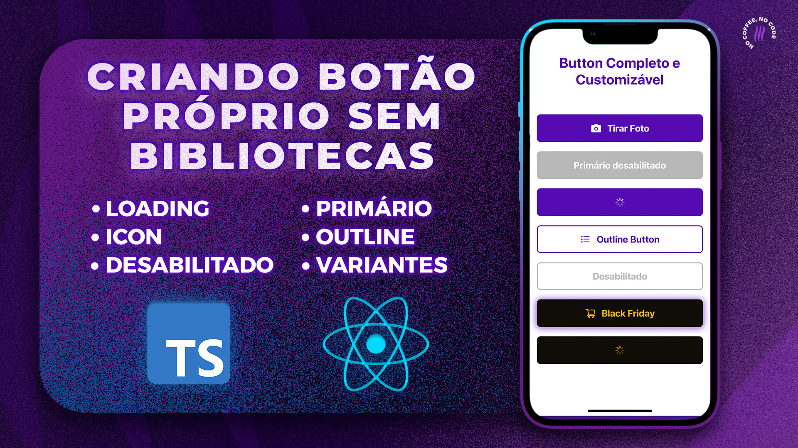

<h2> React Native Button Completo e Customizável do Zero - Loading, Icon, Primário, Outline e Variantes
</h2>

 

## Caso queira ver passo a passo de como o componente foi construído, [acesse o tutorial em nosso canal no YouTube clicando aqui!](https://youtu.be/nHVKRneBRFs)

 

## Button

- Primary e Outline
- Loading
- Icon
- Função de desabilitar

 

Caso este código tenha te ajudo de alguma forma, não deixe de se inscrever no nosso canal no YouTube para acessar mais conteúdos como esse.

### [Canal da Coffstack no YouTube](https://www.youtube.com/Coffstack/)

